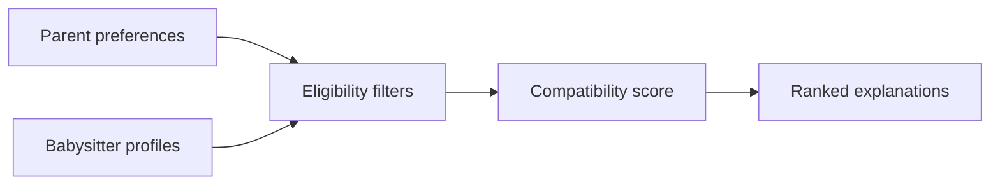

# Sunshine Sitters — Babysitter Matching Prototype

A Java proof of concept that translates parent preferences into an explainable, deterministic ranking of eligible babysitters.

## Problem

Finding suitable childcare requires more than showing a list of profiles. Parents need candidates who are available, within budget and aligned with preferences such as location, experience and certification.

## Implemented features

- Validated parent requests and babysitter profiles
- Filters for availability, budget and required certification
- Transparent compatibility scoring with human-readable reasons
- Dependency-free tests and GitHub Actions CI



## Run

Requires JDK 17 or newer.

```bash
javac -d out $(find src/main/java -name "*.java")
java -cp out sunshinesitters.SunshineSittersApp
```

## Test

```bash
javac -d out $(find src/main/java src/test/java -name "*.java")
java -ea -cp out sunshinesitters.BabysitterMatcherTest
```

## Scope and responsible design

This is an academic prototype, not a production childcare platform. The original concepts included dashboards, messaging, payments and emergency information; these remain design ideas. See [product scope](docs/product-scope.md).

A deployable service would require verified identities and qualifications, safeguarding procedures, secure authentication, encryption and consent-based child-data handling.

## Author

Zandile Monalisa Dladla — COS 101 academic prototype

[Portfolio](https://zandiledladla.github.io) · [GitHub](https://github.com/zandiledladla)
